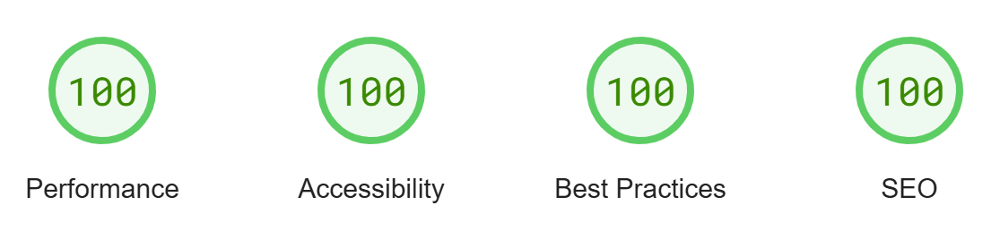

# Blog Site

This is a [Next.js](https://nextjs.org/), [Tailwind CSS](https://tailwindcss.com/) blogging starter template.

**Use it to build your own blog.** Simply fork and follow the instructions below.

Currently acting as my personal blog.

## Demo

- https://vishwaj33t.com/

## Axioms

1. **Next.js First**: use framework (Next.js) features when possible and avoid reinventing the wheel.
2. **Few deeply integrated services**: Uses a simple set of services with free tiers that are well integrated into the platform.

## Features

- ✨ Next.js `/app` dir
- 📝 Blog-like layouts
- 🔍 SEO friendly with RSS feed, sitemaps and metadata
- 🚀 Projects page
- 📑 TOC (Table of contents)
- ⚡ Static Site Generation (SSG)
- 🎨 UI Components built using **Shadcn/ui**
- 📚 **blog** pages using **MDX** and **Contentlayer**
- 🎯 Styled using **Tailwind CSS**
- 📘 Written in **TypeScript**
- 📋 Copy code button
- 🔎 Search with **cmd+k**
- 📱 Mobile-friendly
- 🎨 Customizable tailwind theme
- 👁️ View count for each post using **Prisma** and **Turso**
- 📝 Font optimization with [next/font](https://nextjs.org/docs/app/api-reference/components/font)
- 🌓 Light and dark theme
- 📊 **Posthog** for analytics
- ➗ Math display supported via [KaTeX](https://katex.org/)
- ⚠️ Github alerts via [remark-github-blockquote-alert](https://github.com/jaywcjlove/remark-github-blockquote-alert)
- 🖼️ Automatic image optimization via [next/image](https://nextjs.org/docs/basic-features/image-optimization)
- 💻 Server side code syntax highlight with **Rehype Pretty Code**
- 🔒 Preconfigured security headers
- 🏆 Perfect Lighthouse Scores (Mobile and Desktop)

## Lighthouse Scores



## Quick Start Guide

1. Clone the repo

```bash
git clone https://github.com/vishwaj33t/site.git
```
